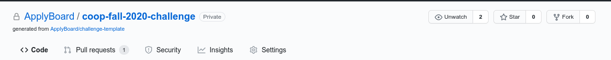
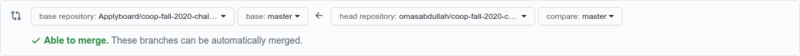

<p align="center">
  <a href="https://evilmartians.com/?utm_source=size-limit">
    
  </a>
</p>

## Background 📖

[applyboard-img]:https://didmdw8v48h5q.cloudfront.net/ca/wp-content/uploads/2018/07/New-2018-AB.png
At ApplyBoard, we believe that education is a right, not a privilege. We empower people around the world to access the best education available. Our platform streamlines the application process from submission to enrolment assisting thousands of students to pursue their dreams of studying abroad.

## Problem 🖥

At ApplyBoard we utilize event sourcing to store changes in our system so that we can replay, undo or redo some event that happened in the past. The given question is to build a system that supports these functionalities.

To simplify the problem, we need to build it for the given requirements:

Given an initial integer value of 0, we need a system to track, add and subtract the value. Additionally, we need to build upon our event tracking to support undo, redo, bulk_undo and bulk_redo functionalities.

We have created a base EventSourcer class that holds an initial value of 0, alongside function signatures as a base, it will be your job to implement the functions. Feel free to add other functions, however do not change the function signatures or the constructor as it will fail the tests.

If you are looking for more details on how the undo/redo functionality should work, check out this video at the timestamp linked: https://youtu.be/X6NJkWbM1xk?t=173 . The implementation we are looking for is the first simple solution mentioned!

**You will have until July 10th 3:00pm to submit your Pull Requests**

### Method Signatures
To complete the challenge, implement the following functions:

```
add(num: integer)
  - add num to the value

subtract(num: integer)
  - subtract num from the value

undo()
  - revert last event

redo()
  - redo next event

bulk_undo(amount: integer)
  - undo the given amount of events

bulk_redo(amount: integer)
  - redo the given amount of events
```

### Example

```
initial_value = 0

add(20)
value: 20

add(30)
value: 50

subtract(10)
value: 40

undo()
value: 50

redo()
value: 40

redo()
value: 40 (Nothing to redo)

bulk_undo(2) (The last two actions were subtract(10) and add(30))
value: 20

bulk_redo(2)
value: 40

```

### JavaScript
#### Writing your solution
1. Open the `javascript_solution.js` file.
2. Implement the `add` `subtract` `undo` `redo` `bulk_undo` and `bulk_redo` functions

#### Testing your solution
1. Use the following command to install `jest` testing framework
```
npm install
```
2. Use the following command to run the tests
```
npm test
```

### Ruby
#### Writing your solution
1. Open the `solution_ruby.rb` file.
2. Implement the `add` `subtract` `undo` `redo` `bulk_undo` and `bulk_redo` functions

#### Testing your solution
1. To test your solution locally use the following command:
```
ruby tests/ruby_solution_test.rb
```

### Python
#### Writing your solution
1. Make sure you are using Python 3! (The tests run using python3)
2. Open the `python_solution.py` file.
3. Implement the `add` `subtract` `undo` `redo` `bulk_undo` and `bulk_redo` functions

#### Testing your solution
1. To test your solution first [Install](https://pip.pypa.io/en/stable/installing/) pip
2. Install `pytest` using the following command:
```
pip install -r requirements.txt
```
3. Use pytest to run the tests with the following command:
```
pytest
```

## Submitting your attempt
1. Fork the repository


2. Make your changes on the master branch in your fork.
3. Create a Pull Request. Make sure the base is set to `Applyboard/fallcoop-fall-2020-challenge`

4. Keep committing! We will take into consideration all commits made before the time cutoff!

## Pull Request Labels
| Label | Description |
| -- | -- |
| Coop Fall 2020 | Tag your PR with this label to be considered for a Fall 2020 coop! |
| Coop Winter 2021 | Tag your PR with this label to be considered for a Winter 2021 coop! |
| Full Time | Tag your PR with this label if you are applying for fulltime! |
| Student | If you are a student you will be eligible for the prizes! Tag your PR with this label to be considered for prizes! |

*We will verify your student email address if you are selected for a prize*

## Winner Criteria
While anyone is encouraged to attempt the challenge, **Only students are eligible for prizes**. If you are are a student, add the "Student" tag to your PR to be considered for a prize!

The winner of the challenge will be selected based on:

* Correctness
* Readability
* Efficiency
* Edge-case handling

## Rules ⚠
* You **may not** use any existing libraries, or copy existing code.
* You should fork this project, and submit your entry by submitting a pull request to `master`.
* Your latest commit must be on GitHub no later than the time specified by the engineer running the challenge.

## Problems/Issues?
If you run into any issues during the challenge:
1. Join the zoom link that was provided to all candidates who signed up
2. Submit an issue on Github! (https://github.com/ApplyBoard/coop-fall-2020-challenge/issues) One of our staff will try to help you debug whatever issue you're running into.
